# 币安和OKX交易所实操指南：从买卖USDT到机场付款全流程

---

想用USDT给机场续费，却不知道怎么在交易所操作？担心买到黑U被银行冻卡？本文手把手教你使用币安和OKX交易所，涵盖买卖USDT、转账付款、收款充值的完整流程，还会告诉你如何避开常见坑点，让你的每一笔交易都安全顺利。

---

## 开始之前：注册与准备工作

先去币安和OKX分别注册账号并完成认证。注意两点：
1. 全程需要代理，但**不能用香港和新加坡节点**
2. USDT支付时，交易所会扣1U手续费，所以实际转账要多加1U

关于USDT的两种主流网络：
- **TRC20**（波场）：地址以T开头，手续费便宜，日常首选
- **ERC20**（以太坊）：地址以0x开头，手续费贵，非必要不用

👉 [立即注册OKX，享手续费减免优惠](https://www.okx.com/join/62834398)

---

## 一、币安使用教程

### 注册入口
访问币安官网注册时，使用邀请码**JM711M0P**可获得终生10%手续费返还。

### 1. 如何买卖USDT

打开币安APP，点击**首页 → 快捷买币**

**买入方式有两种：**
- **自选区**：自己挑商家交易，记住要选注册时间长、交易量大的商家，别贪便宜买到黑U
- **快捷区**：系统自动匹配最优价格，省心但要注意商家信誉

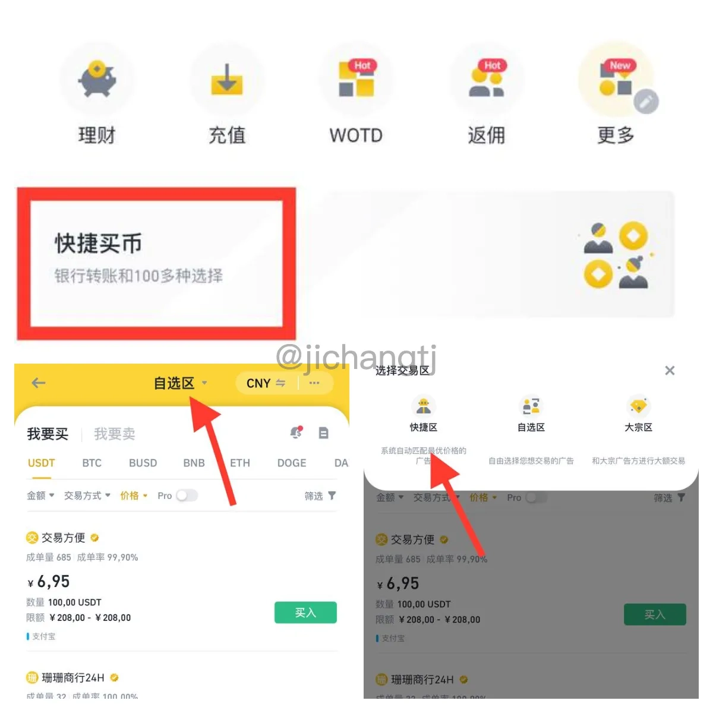

卖出USDT时，点击页面上方的"我要卖"即可。同样要小心收黑钱的风险。

### 2. USDT转账付款（机场支付）

这就是提现操作，一般用TRC20网络，手续费只要1U。

**操作路径：**
APP右下角**资金 → 提现 → 选择USDT → 通过区块链转账 → 输入收款地址（或扫码） → 选择TRC20网络**

**重点：**转账金额 = 对方需要的金额 + 手续费。比如对方要10U，你用TRC20就转11U。

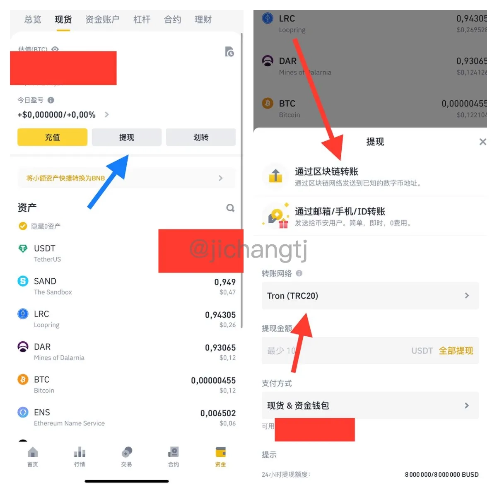

### 3. USDT收款

别人给你转USDT时，你需要提供自己的收款地址。

**操作路径：**
APP右下角**资金 → 充值 → 选择USDT → 选择TRC20 → 复制地址**，发给对方就行。

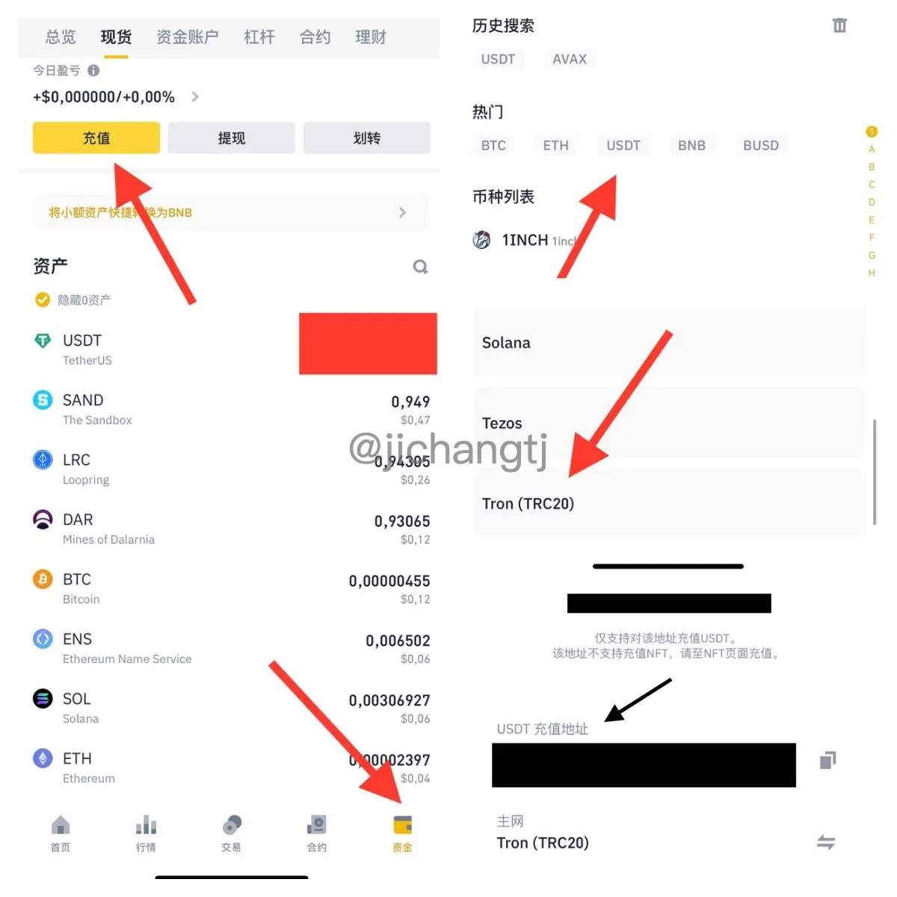

### 4. 买币和合约交易

#### 现货交易
点击**交易 → 现货**，输入买入金额即可。适合长期持有或不想加杠杆的保守玩家。

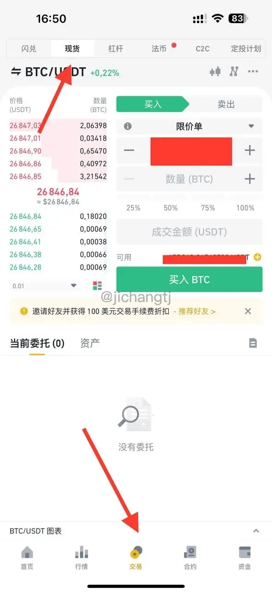

#### 合约交易
如果想加杠杆，选择底部**合约**（默认U本位，也可选币本位）。

**注意：**合约需要先从现货账户划转到合约账户。

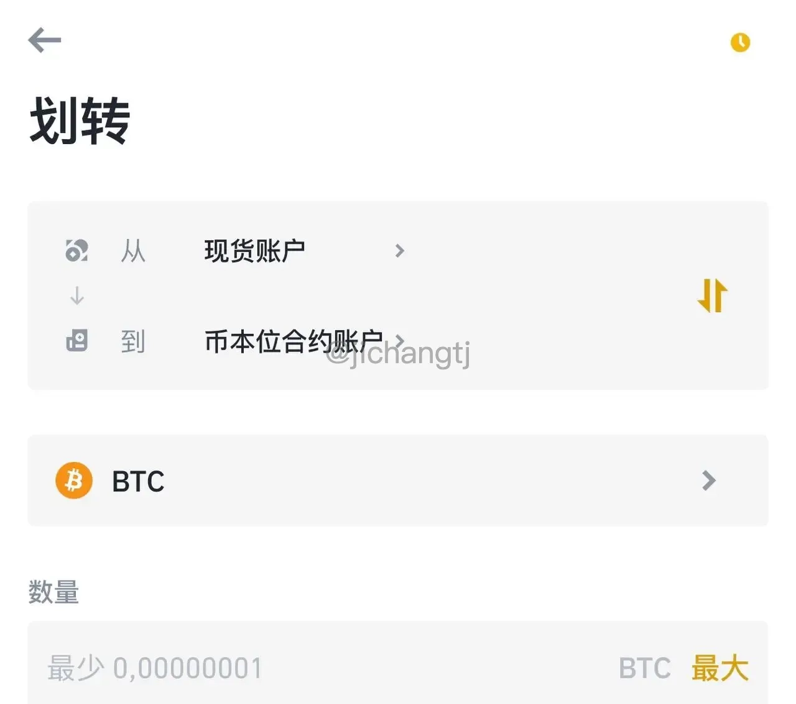

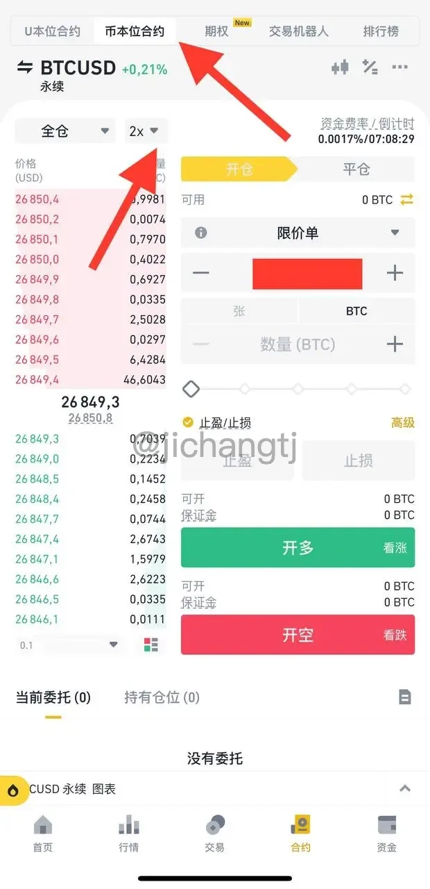

左上角可调节杠杆。温馨提示：别开太高倍数，2-3倍比较稳，不是人人都是开100倍的大佬。

---

## 二、OKX使用教程

### 注册入口
使用邀请码**62834398**注册OKX，可获得手续费减免。

### 1. 如何买卖USDT

打开OKX APP，点击**首页 → 快捷买币或C2C买币 → 选择USDT**

- **快捷买币**：系统自动匹配，方便快捷
- **C2C买币**：自选商家，同样要避开黑U陷阱

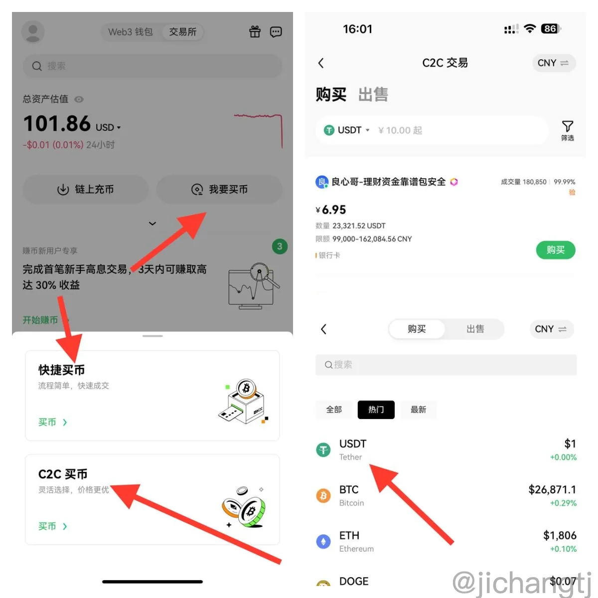

**重要提示：**OKX买的U需要第二天才能转账。

卖U的话点击"**出售**"即可。我个人更常用OKX卖U，体验比币安稍好一些。

### 2. USDT转账付款

提币就是转账，操作和币安类似。

**操作路径：**
APP右下角**资产 → 提币 → 选择USDT → 链上提币 → 输入地址 → 选择TRC20 → 输入金额**

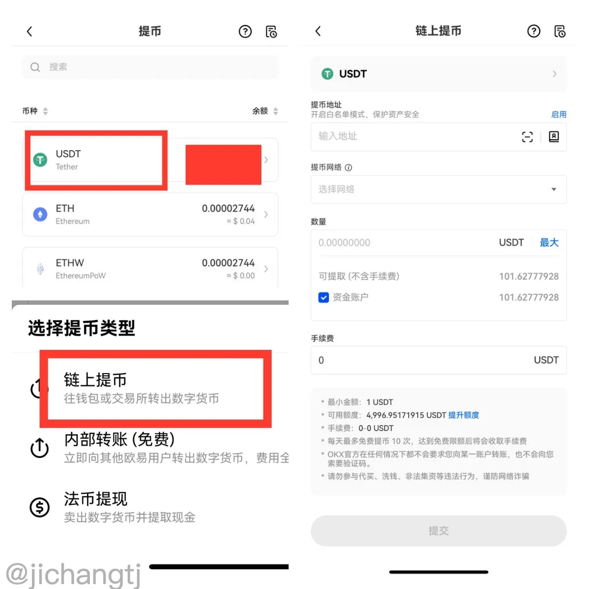

**给机场付款时：**直接复制机场页面的U地址到提币地址，金额必须精确到小数点，不能多也不能少，而且动作要快，别让页面刷新。

### 3. USDT收款

**操作路径：**
APP右下角**资产 → 充币 → 链上充币 → 选择USDT → 选择USDT-TRC20 → 复制地址**

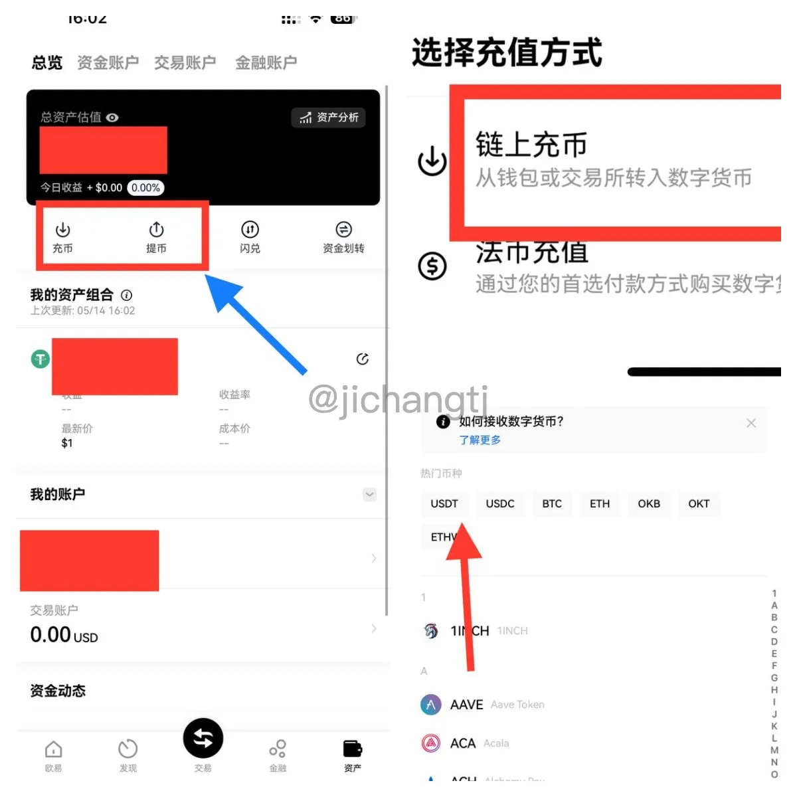

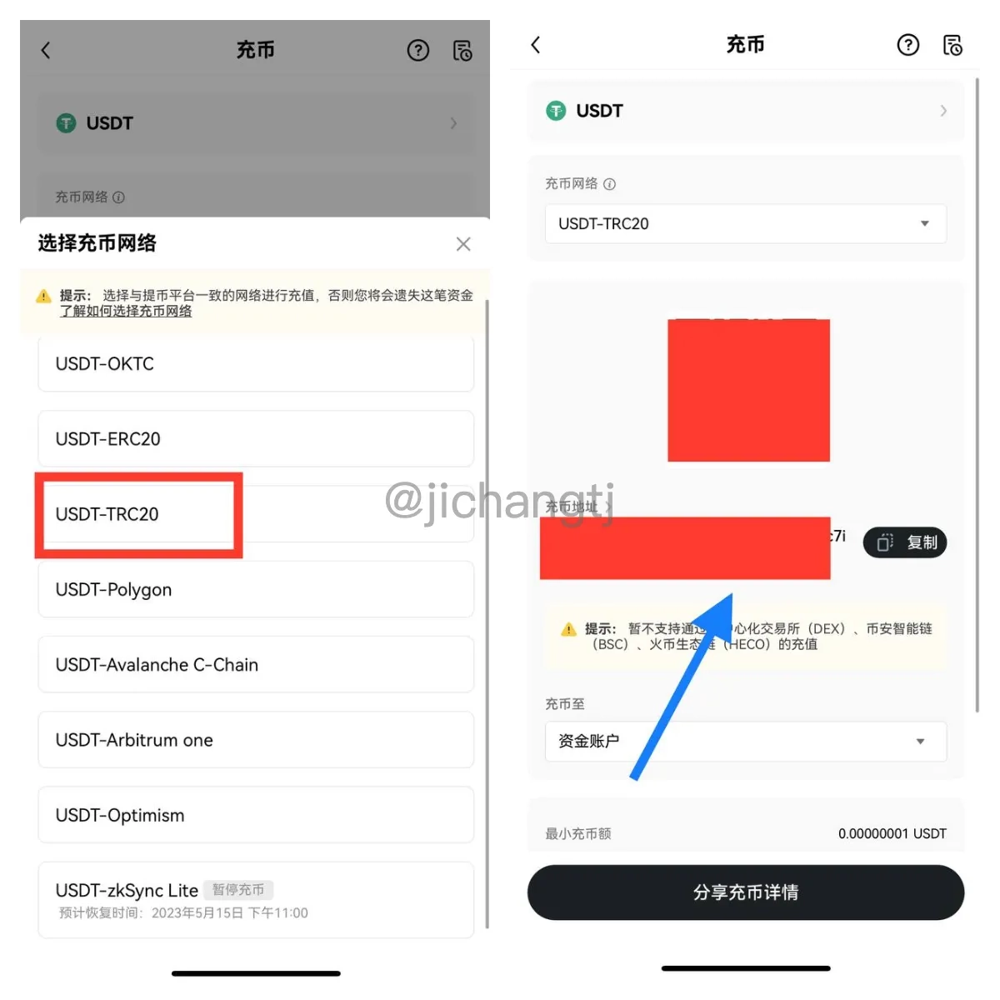

### 4. 买币和合约交易

OKX买币前需要先去**资产页面划转**，从资金账户转到交易账户。

- **现货**：底部**交易 → 币币交易**
- **合约**：底部**交易 → 永续**

左上角可切换不同币种。

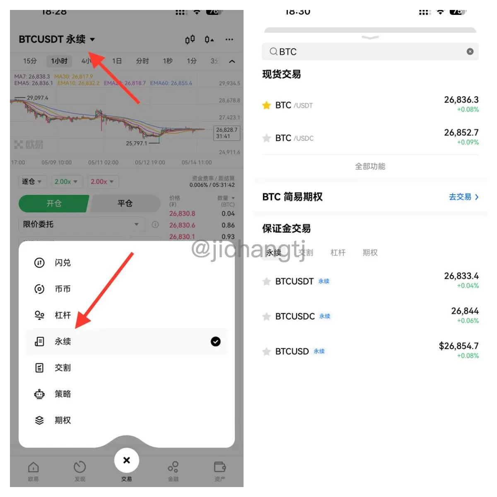

---

## 三、隐私增强方案：门罗币

USDT交易记录是公开的，可以在区块链浏览器查到（比如 https://007.tg/u-address/）。如果你需要更高的隐私性，可以用门罗币（XMR）。

### 如何使用门罗币

在交易所点击"**闪兑**"：
- 币安：主页"更多"里或顶部搜索"闪兑"
- OKX：资产里面找到闪兑

选择 USDT → XMR，然后用XMR转账即可。

### 推荐钱包

- [官方钱包](https://www.getmonero.org/downloads/)
- [Cake Wallet](https://cakewallet.com/) - 可混币
- [MyMonero](https://mymonero.com/)
- [Monerujo](https://monerujo.io/) - 仅限安卓
- [Edge](https://edge.app/)

**混币流程：**
1. 交易所买XMR
2. 创建多个门罗钱包互相转账（利用环签名技术匿名）
3. 在LocalMonero将XMR换回USDT

匿名是有代价的，要么多花时间，要么多花手续费。

### 其他混币工具

- **Mixing Cash**：一键转换币种
- **ChangeNow**：跨币种兑换

---

## 四、本地钱包与匿名购买

如果你担心币安和OKX这些中心化交易所的安全性（毕竟要实名认证），可以用本地钱包：

- **ETH及ERC20的USDT**：MetaMask
- **TRON的USDT**：TronLink或Trust Wallet

**匿名购买USDT：**
可以去 [Paxful](https://paxful.com/zh/buy-tether/wechat-pay/?paymentMethod=wechat-pay&countryIso=HK&hasScroll=true) 用微信不实名购买。

**关于TRX能量：**
冷钱包转账需要消耗TRX，你可以：
- 租TRX
- 用USDT兑换TRX
- 在TronLink质押获得能量（类似存款生息，能量可抵扣转账费用）

---

## 五、炒币进阶书单

如果你对交易感兴趣，这些书值得一读：

**必读经典：**
- 《股票大作手回忆录》
- 《期货大作手风云录》
- 《以交易为生》

**进阶推荐：**
- 《十年一梦》
- 《期货交易策略》
- 《价格形态解密》
- 《Price Action》
- 《CIS股票交易术》
- 《金融怪杰》

---

## 总结

无论是日常给机场续费，还是想更深入地参与加密货币交易，币安和OKX都是相对成熟的平台选择。记住核心原则：**选信誉好的商家、注意网络选择、金额算准手续费**。如果需要更高隐私性，门罗币是不错的方案。

👉 [马上注册OKX开始你的第一笔USDT交易](https://www.okx.com/join/62834398)

新手建议先小额试水，熟悉流程后再逐步加大金额。安全第一，稳字当头。
